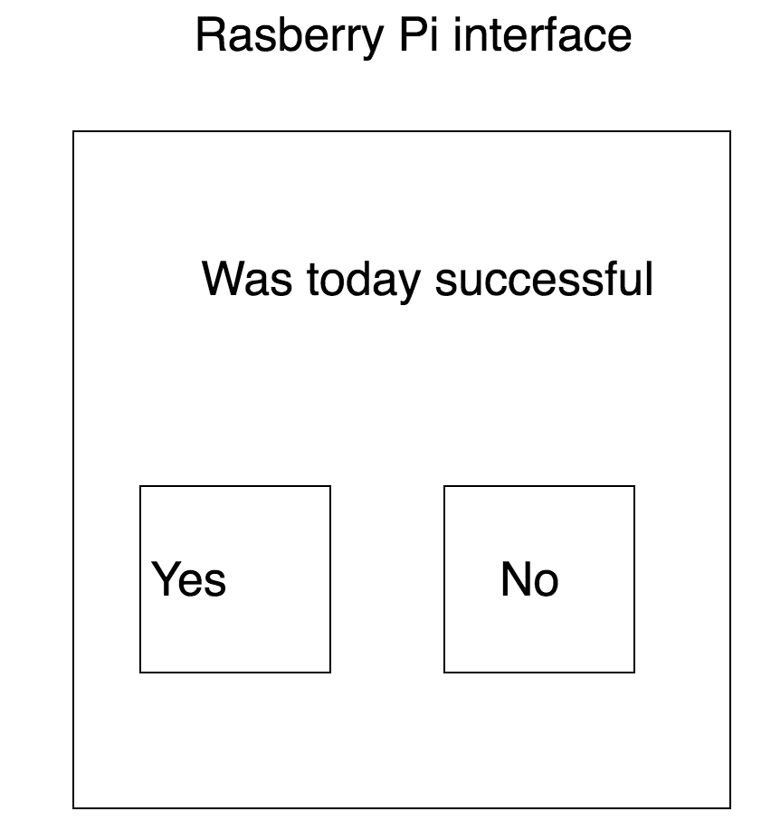

# Daily Calendar
## Description
* It will have a feature like the github green squares, letting you measure consistancy
* It will be tangible. (There will be a hardware component to it)
* It could have a daily video feature. (This could be its own app)
 * ex we could prompt the user to leave a video message for themself in a year("What message do you want to give to yourself 1 year from now")
 
## Mockups

 
 
## Expected Components
 * Backend
  * Definitely going to need an API
 * Front end 
  * Hardware component 
  * App
  * Website (Probably not)
 
## MVP - Minimun Viable Product
### Hypothesis
1. If I have the ability to easily keep track and analyze my consistency in working towards something, then I will be more productive
2. If I find that I'm being more productive as a result of using this product, then I will use it more.

### Goals
* The ability to easily mark down how well they did that day
* We need to give people the ability to easily view their progression

### Features
* Mimic green square UI from github
* Some Standalone hardware app
* Some Standalone Mobile UI

### Questions to ask after MVP is built out
* Is this worth continuing?
* Is anyone interested in the product
* Am I able to use it easily?
* Would it become useful if it had more features? (What features excite me)

# Roadmap (Order in which we are going to build out every piece)
* Build out an API (Python / Hack)
* Build a javascript (React) app that can be run on a rasberry pi
* Build a mobile app (ios first, then android)
